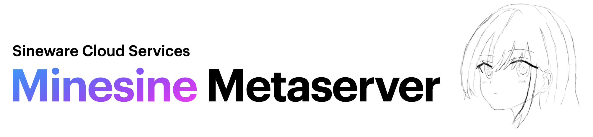
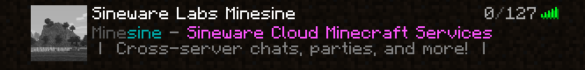
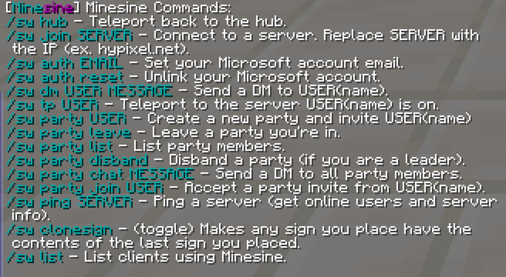

# Sineware Labs *Minesine Metaserver*

Minesine is a "metaserver". It is designed to let you connect to any public Minecraft through it.

## **The public Minesine instance is available at: `mc.sineware.ca`** (1.18.2 and 1.19, 1.19.x unsupported)


This allows for useful features, for example, quickly hopping between servers, being able to create a party of players and have the 
party move between otherwise separate servers, DM messaging between players on different servers, etc. Minesine works by
parsing and proxing game packets between the user and target server, by utilizing a virtual client connection. Minesine intercepts 
certain packets on the fly to implement its features.

Future goals include features such as server fast-switching (spawning multiple virtual clients). Minesine allows users to have modded/tweaked experiences 
without requiring any custom software. **Current tweaks include unlocking render distance limits, faking the client OP level (ex. allows F3+N/F3+F4 gammeode switching if the player has gamemode command permissions), and simple sign content cloning.**


> Minesine is a Sineware Labs experiment designed to showcase Sineware Cloud Services technologies, such as network routing.

## Player Usage


## For Server Administrators
Minesine is effectively a custom Minecraft client, and as such, players connected through Minesine may not behave like Vanilla/Notchian clients (especially when used tweaked experiences). In addtion:

- Chat messages starting with the command "/sw" are caught and handled by Minesine, and are not passed through to the target server.
- Users connected through Minesine will appear to be connected from the same few IP addresses. This is by design, and you should **not** use IP Bans. They are a weak security measure to begin with, and fail to address other real-world situations such as CGNAT.
- Users connected through Minesine may be flagged by anti-VPN plugins (due to the same reason as above). We encourage you to whitelist "mc.sineware.ca" in your respective plugins.

### BungeeCord Plugin Messaging Channel
Minesine implements a subset of the [BungeeCord Plugin Messaging Channel specification](https://www.spigotmc.org/wiki/bukkit-bungee-plugin-messaging-channel/) (plugin channel bungeecord:main). This allows you to send 
messages to the Minesine Server through a player connection, and perform actions such as moving players between public servers, 
obtaining the real IP of a player, etc.

Supported Subchannel Commands:
- Connect (where server name is a hostname)

## Development
Terminology:

- `client/user`: refers to the users real client and connection to the metaserver.
- `client state`: JS Map of user UUIDs containing state information related to Minesine.
- `server/metaserver`: The instance of Sineware Minesine.
- `virtual client`: the instance of a node-minecraft-protocol client that connects to the target server (packets are then proxied between the client and virtual client)
- `target server`: the minecraft server that a virtual client connects to (ex. Hypixel)

Msa (Microsoft authentication) tokens are cached by node-minecraft-protocol in ~/.minecraft/nmp-cache/. (Passwords are never stored).

Create a .env file for the PostgreSQL details (see tables.sql for database tables):
```text
PGUSER=
PGHOST=
PGPASSWORD=
PGDATABASE=
```

`npm start` will run src/index.ts with ts-node.

## Todo
- Test a TCP load balancer (ex. HAProxy)
- Implement the accounts manager
- Implement the window GUI
- i18n messages
- Discord integration
- Handle modded clients
- /sw profile USER
- external monitoring/cleanup db service (online users)
- Bookmarks
- Velocity Modern Player Forwarding (login_plugin_request)
- clean up debug logs
- Multi-version support
- Clear boss bars/titles/tab menu on server switch
- dm reply (/sw dm r)
- party chat toggle
- cosmetics (particles, chat, etc)
- command autocomplete
- A lot more

## License
```text
Copyright (C) 2022  Seshan Ravikumar

This program is free software: you can redistribute it and/or modify
it under the terms of the GNU Affero General Public License as
published by the Free Software Foundation, either version 3 of the
License, or (at your option) any later version.

This program is distributed in the hope that it will be useful,
but WITHOUT ANY WARRANTY; without even the implied warranty of
MERCHANTABILITY or FITNESS FOR A PARTICULAR PURPOSE.  See the
GNU Affero General Public License for more details.

You should have received a copy of the GNU Affero General Public License
along with this program.  If not, see <https://www.gnu.org/licenses/>.

```